# IFRS 9 Benchmarking Studio

A high-performance extraction and benchmarking tool designed to analyze IFRS 9 disclosures in bank annual reports. Using advanced LLM-powered extraction (via Groq), it automates the process of gathering and comparing Expected Credit Loss (ECL) data across multiple financial institutions.

## Features

- **Automated PDF Parsing**: Intelligent page selection and extraction using multiple parser options.
- **LLM-Powered Extraction**: Leverages Groq-hosted Llama models for precise data point retrieval.
- **Benchmarking Reports**: Generates comprehensive comparison reports in HTML, JSON, and PDF formats.
- **FastAPI Backend**: Modern, asynchronous API for handling document uploads and pipeline orchestration.
- **Interactive UI**: Clean web interface for monitoring extraction progress and viewing results.

## Project Structure

- `app.py`: FastAPI application and API endpoints.
- `ifrs9_benchmark/`: Core logic including the pipeline, LLM integration, and reporting.
- `static/`: Frontend assets (HTML, CSS, JS).
- `requirements.txt`: Python dependencies.

## Setup

### Prerequisites

- **Python 3.9 or higher** - [Download Python](https://www.python.org/downloads/)
- Verify installation: `python --version` (Windows) or `python3 --version` (Mac)

---

### For Windows

1. **Clone the repository:**
   ```powershell
   git clone https://github.com/HarshdipSaha/FincanceExtractor.git
   cd FincanceExtractor
   ```

2. **Install dependencies:**
   ```powershell
   python -m pip install --upgrade pip
   pip install -r requirements.txt
   ```

3. **Configure API Keys:**
   
   Create a `.env` file in the project root with your Groq API key:
   ```powershell
   echo GROQ_API_KEY=your_api_key_here > .env
   ```
   
   Or manually create a `.env` file with:
   ```
   GROQ_API_KEY=your_actual_groq_api_key
   ```

4. **Run the application:**
   ```powershell
   python app.py
   ```
   The application will be available at `http://127.0.0.1:8000`

---

### For macOS

1. **Clone the repository:**
   ```bash
   git clone https://github.com/HarshdipSaha/FincanceExtractor.git
   cd FincanceExtractor
   ```

2. **Install dependencies:**
   ```bash
   pip3 install --upgrade pip
   pip3 install -r requirements.txt
   ```

3. **Configure API Keys:**
   
   Create a `.env` file in the project root with your Groq API key:
   ```bash
   echo "GROQ_API_KEY=your_api_key_here" > .env
   ```
   
   Or manually create a `.env` file with:
   ```
   GROQ_API_KEY=your_actual_groq_api_key
   ```

4. **Run the application:**
   ```bash
   python3 app.py
   ```
   The application will be available at `http://127.0.0.1:8000`

---

### Getting Your Groq API Key

1. Visit [https://console.groq.com/](https://console.groq.com/)
2. Sign up and get your free API key
3. Copy the key and add it to your `.env` file as shown above

## Usage

1. Upload one or more bank annual reports (PDF).
2. Select the preferred parser and LLM model.
3. Wait for the extraction pipeline to complete.
4. Download the generated benchmarking report in your preferred format.

## How it works

The web path (`app.py` -> `ifrs9_benchmark/pipeline.py`) runs one `BenchmarkPipeline` per upload batch:

```mermaid
flowchart LR
  UP["Upload PDFs (static/index.html, POST /api/reports)"] --> PARSE["parser.PdfParser: per-page text via pdfplumber, page scored by ONTOLOGY keywords"]
  PARSE --> SELECT["select_candidate_pages (max_pages_per_pdf, default 80)"]
  SELECT --> RAG["pipeline.build_llm_context: chunk pages, BM25 retrieval against the IFRS 9 ontology"]
  RAG --> LLM["llm.GroqExtractor: Groq chat completion (default llama-3.3-70b-versatile), JSON output, key rotation"]
  LLM --> MODEL["models.FirmReport (pydantic): core ECL table, staging, movements, model design, notes"]
  MODEL --> VAL["validator.validate_citations: keep only numbers visible on the cited pages"]
  VAL --> REPORT["reporting.render_outputs: JSON, HTML (Jinja2 template), PDF (reportlab)"]
  REPORT --> DL["GET /api/reports/{run_id}/json, html, pdf"]
```



`GROQ_API_KEY` is read from `.env` by `config.py`; several keys can be provided and the extractor rotates between them on rate-limit errors.

## Project structure (detailed)

```
app.py                      FastAPI app: /, /api/reports, /api/reports/{run_id}/{json,html,pdf}, /api/health
ifrs9_benchmark/
  pipeline.py               BenchmarkPipeline (parse -> select -> BM25 context -> LLM -> validate -> render)
  parser.py                 PdfParser (pdfplumber), ONTOLOGY keyword map, page scoring and selection
  llm.py                    GroqExtractor, JSON normalisation, key rotation
  models.py                 pydantic models (FirmReport, BenchmarkReport, MetricValue, ...)
  validator.py              citation check of extracted numbers against page text
  reporting.py              JSON / HTML / PDF rendering; templates/report.html
  config.py                 .env loading, Groq key list
  cli.py, extract.py, fetch.py, parse.py, report.py   earlier URL-driven CLI path (python -m ifrs9_benchmark)
static/                     index.html, app.js, styles.css
tests/test_extract.py       unit tests for the extract module
ARCHITECTURE.md, CONCEPT.md non-technical walkthrough of the design
*.pdf, *_report.*           sample annual reports and generated reports kept in the repo
```

## Status and limitations

- Two code paths coexist: the FastAPI + Groq pipeline described above, and an older CLI (`cli.py`, `extract.py`, `fetch.py`, `report.py`) that discovers filings by URL and extracts with regex/table heuristics. `pyproject.toml` still describes the older scope.
- `parser.py` imports `pdfplumber`, which is not listed in `requirements.txt` (which lists `pymupdf` / `pymupdf4llm` instead); install it separately if the import fails.
- Extraction quality depends on the LLM; the citation validator drops numbers it cannot find on the cited pages but does not guarantee completeness.
- A `.venv/` directory and several large sample PDFs are committed; a fresh install via `requirements.txt` is recommended.
- Tests cover only the extract module (`tests/test_extract.py`).
